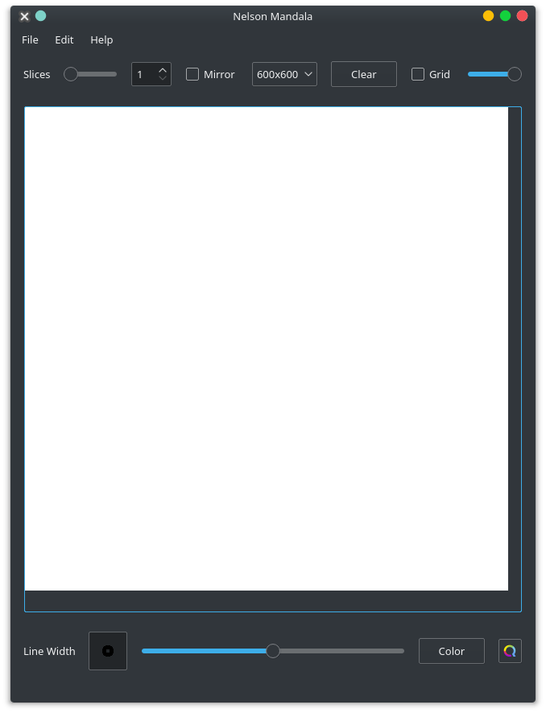

<h1> <a href="https://github.com/JulienChevron/NelsonMandala" style="text-align: center">Projet Mandala</a> </h1> 

Mandala for ENSICAEN

Pour compiler et lancer le logiciel : 
```bash
mkdir build
cd build
cmake ../
make
./Mandala
```

## 1. Fonctionnalités du logiciel

Le logiciel permet actuellement de : 
- Dessiner
- Dessiner avec l'effet mandala
- De choisir la taille et la couleur de son crayon
- Dessiner avec un effet "rainbow"
- Sauvegarder ses images
- Changer la taille de l'image
- D'afficher une grille pour simplifier le dessin avec le mandala
- De revenir à un état précedent du dessin avec un système de "undo/redo"


## 2. Fonctionnalités à implémenter

Il reste à implémenter : 
- Un effet miroir
- Une transparence de la grille modifiable

## 3. Repartition des tâches

- Interface : Julien Chevron
- Dessin : Julien Chevron
- Commandes de dessin : Pierre Chopinet
- Undo/Redo : Pierre Chopinet
- Sauvegarde : Pierre Chopinet

## 4. Interface du logiciel




## 5. Divers

Merci à l'ensicaen pour ce super projet !